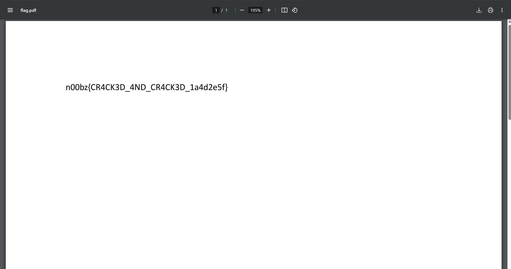

# Crackk It

## Tools Used
- Python (for ZIP cracking)
- pdfcrack (for PDF password recovery)

The challenge involved two stages: cracking a ZIP file and unlocking a password-protected PDF to retrieve the final flag. Two password lists (file1.txt, file2.txt) were provided.

## ZIP File

file1.txt had patterned entries like 1337h4x0r, suggesting it might be the correct password. A Python script was used to brute-force the ZIP:

```from zipfile import ZipFile

with open("file1.txt") as f:
    for pwd in f:
        try:
            ZipFile("flag.zip").extractall(pwd=bytes(pwd.strip(), 'utf-8'))
            print(f"Password found: {pwd.strip()}")
            break
        except:
            continue
```
Password found:
`1337h4x0r`

## PDF File

Using pdfcrack and file2.txt, we brute-forced the PDF password:
```pdfcrack -f flag.pdf -w file2.txt```

Password found:
`noobmast96`



Flag - `LakshyaCTF{n00bz{CR4CK3D_4ND_CR4CK3D_1a4d2e5f}}`
