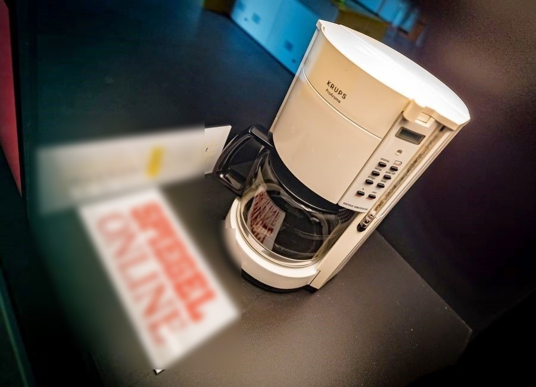

# Silent Witness

In this challenge, we were presented with an image of an object and tasked with identifying both its current location and the floor it’s displayed on. At first glance, the object appeared to be an old coffee machine, but it was clear there had to be more to the story. After doing a reverse image search and digging into its background, I discovered that this was no ordinary appliance—it was the iconic Trojan Room Coffee Pot, famously known as the subject of the world’s first webcam.

Back in 1991, researchers at the University of Cambridge set up a camera pointing at the coffee pot in the Trojan Room of the Computer Laboratory. The live video feed helped staff avoid unnecessary trips to check whether there was coffee, making it an early and quirky example of what we now call the Internet of Things.

Once the coffee machine was decommissioned in 2001, it was sold on eBay and later acquired by the Heinz Nixdorf MuseumsForum in Paderborn, Germany. This museum, which happens to be the world’s largest computer museum, now hosts the machine as a part of its exhibition on internet history.

To complete the flag, I needed to determine the specific floor where the machine is located. With some research through the museum’s website and related online documentation, I confirmed that the Trojan Room Coffee Pot is displayed on the second floor of the museum.

Flag - `LakshyaCTF{heinz_nixdorf_museumsforum_2}`
