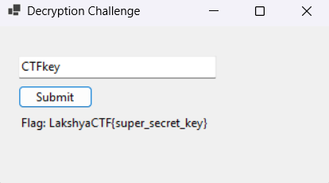

# Flag Extractor

## Tools Used
- ILSpy (.NET Decompiler)

## Description

The program prompts for a field (likely input from the user) and processes it in some way. Your task is to reverse engineer the program, analyze its behavior, and determine the correct input (field) that will generate the flag as output.

## Approach
At first, I attempted to reverse engineer the executable using Ghidra. However, I quickly realized that the binary was written in C# (.NET), making ILSpy a more appropriate tool for the task.

While looking at the structure of the binary, I found a file `RE.dll` located in:

`AppData/Local/Temp/.net`

This DLL contained the main logic of the challenge. After loading it into ILSpy and examining the code, I discovered two ways to retrieve the flag:

```// RE, Version=1.0.0.0, Culture=neutral, PublicKeyToken=null
// WinFormApp.MainForm
using System;
using System.Text;

private string DecryptFlag(string key)
{
	try
	{
		byte[] bytes = Encoding.UTF8.GetBytes(key);
		byte[] array = Convert.FromBase64String(encryptedFlag);
		byte[] array2 = new byte[array.Length];
		for (int i = 0; i < array.Length; i++)
		{
			array2[i] = (byte)(array[i] ^ bytes[i % bytes.Length]);
		}
		string @string = Encoding.UTF8.GetString(array2);
		return (@string == "LakshyaCTF{super_secret_key}") ? @string : null;
	}
	catch
	{
		return null;
	}
}
```

1. The flag was directly embedded as plaintext within the code.
2. Alternatively, the program used a simple XOR encryption algorithm. By reverse engineering the decryption logic, I was able to deduce the correct input (the XOR key) that would produce the flag during execution.
3. Key - `CTFkey`




## Flag
```LakshyaCTF{super_secret_key}```
