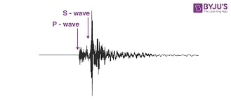

# 126 km West of Ostrov Beringa Island

This challenge revolved around a file named wow.jpg, which, at first glance, appeared to be a simple JPEG image. However, given the nature of the challenge and its title, it hinted at a steganography-based problem—something hidden beneath the surface of the image.

The image and the title hinted something related to earthquake. It turned out that the password for the image was `seismograph`.

Using the password, I was able to extract a hidden file named flag.txt. Opening the file, I found an encoded string that clearly wasn’t readable at face value:

`4HE1o6T_Ev8]k#!X5f$HsB+R(@FciA]]-?QEO>a:#1Ez&pZZ5'[_o9T_F!8]AN!X6*$Hjv+EDLH.$naI-?s{O>+1#5i@`

Recognizing that this might be Base92 encoded, I used a Base92 decoder and successfully converted the string into a hexadecimal representation. The decoded hex output was:

`4c 61 6b 73 68 79 61 43 54 46 7b 53 74 65 67 6f 5f 69 73 5f 68 61 72 64 7d`

Translating this from hex to ASCII gave the final flag:

Flag - `LakshyaCTF{Stego_is_hard}`
